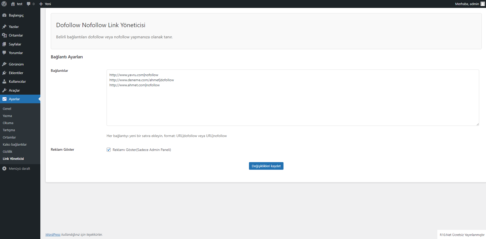

# Dofollow Nofollow Link Yöneticisi

Belirli bağlantıları dofollow veya nofollow yapmanıza olanak tanır.

## Özellikler

- Bağlantıları dofollow veya nofollow olarak işaretleyebilirsiniz.
- Her bağlantı için ayrı ayrı ayarlar yapabilirsiniz.
- Kolay kullanıcı arayüzü.

## Kurulum

1. WordPress yönetici panelinize giriş yapın.
2. Sol taraftaki menüden "Eklentiler"e tıklayın.
3. "Yeni Ekle" butonuna tıklayın.
4. "Eklenti Yükle" butonuna tıklayın ve "Dofollow Nofollow Link Yöneticisi" dosyasını yükleyin.
5. Eklentiyi etkinleştirin.

## Kullanım

1. WordPress yönetici panelindeki "Ayarlar" menüsünden "Link Yöneticisi" sayfasına gidin.
2. Bağlantıları ve nofollow/dofollow ayarlarını girin.
3. Değişiklikleri kaydedin.

## Ekran Görüntüleri

## Lisans

Bu proje [MIT Lisansı](LICENSE) altında lisanslanmıştır.
